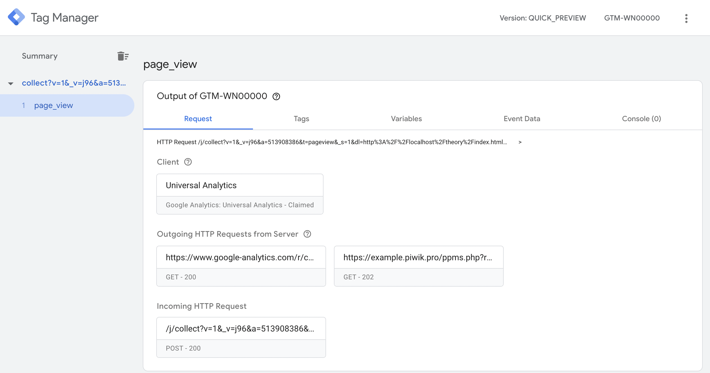

# Piwik PRO Analytics template for Google Tag Manager (server-side)

Analyze the customer journey across websites and apps.

If you’re using server-side Google Tag Manager to collect data from your site or app, you can also send that data to Piwik PRO Analytics. Our integration lets you pass events tracked with Google Analytics to Piwik PRO Analytics in real time.

